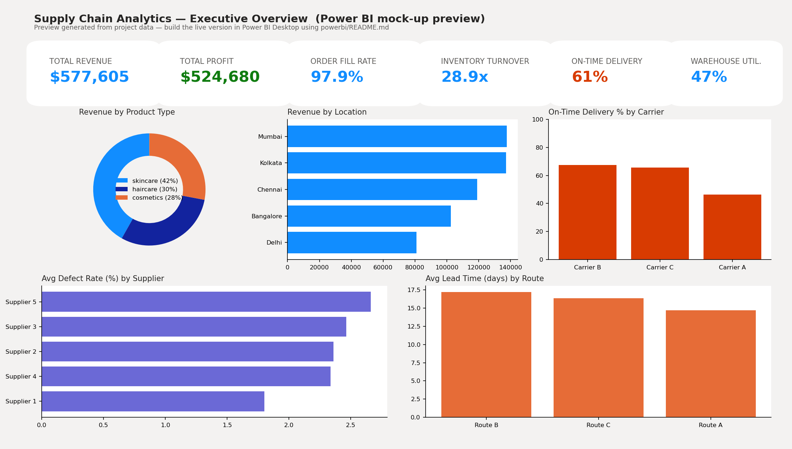

# Supply Chain Analytics using SQL, Power BI & Python

Analyzed 100+ supply chain records using SQL and Python to monitor inventory, supplier
performance, warehouse operations, and delivery efficiency — with interactive Power BI
dashboards tracking Order Fill Rate, Inventory Turnover, On-Time Delivery, and Warehouse
Utilization, plus root-cause analysis of operational bottlenecks.

**Tech stack:** SQL · Python (pandas, matplotlib, seaborn) · Power BI (DAX)


*Executive Overview page — see [`powerbi/README.md`](powerbi/README.md) to build the live, interactive Power BI version.*

**🔴 Live dashboard:** this repo also ships a fully interactive [Streamlit](https://streamlit.io)
app (`app.py`) with the same KPIs, filters, and charts, deployable for free in a few minutes —
see [Deploy the live dashboard](#deploy-the-live-dashboard-streamlit) below.

---

## What's in this project

- **Data cleaning & modeling** — raw CSV transformed into a clean, analysis-ready star schema
  (`python/01_data_cleaning.py`)
- **SQL analysis** — schema, data-quality checks, KPI queries, supplier/inventory/root-cause
  queries (`/sql`)
- **Python EDA** — a full exploratory notebook plus standalone scripts that generate every
  chart in `/visuals` (`/python`)
- **Power BI dashboard** — a ready-to-import data model, DAX measures for every KPI, and a
  page-by-page build guide (`/powerbi`)
- **Written insights** — findings and recommendations a stakeholder could act on
  (`/reports/insights_and_recommendations.md`)

## Repository structure

```
supply-chain-analytics/
├── data/
│   ├── raw/                        # original dataset
│   │   └── supply_chain_data.csv
│   └── processed/                  # cleaned data + star schema (fact/dim tables)
│       ├── supply_chain_cleaned.csv
│       ├── data_quality_report.csv
│       ├── fact_supply_chain.csv
│       ├── dim_product.csv
│       ├── dim_supplier.csv
│       ├── dim_shipping.csv
│       └── dim_location.csv
├── sql/
│   ├── 01_create_schema.sql
│   ├── 02_data_quality_checks.sql
│   ├── 03_kpi_queries.sql
│   ├── 04_supplier_performance.sql
│   ├── 05_inventory_analysis.sql
│   └── 06_root_cause_analysis.sql
├── python/
│   ├── 01_data_cleaning.py
│   ├── 02_exploratory_analysis.py
│   ├── 03_kpi_analysis.py
│   ├── supply_chain_analysis.ipynb
│   └── requirements.txt
├── powerbi/
│   ├── README.md                   # step-by-step dashboard build guide
│   ├── DAX_measures.txt            # copy-paste-ready DAX for every KPI
│   ├── data_model_schema.md        # table/relationship reference
│   ├── generate_dashboard_preview.py
│   └── dashboard_preview.png
├── visuals/                        # exported chart PNGs (10 charts)
├── reports/
│   ├── insights_and_recommendations.md
│   └── kpi_summary.txt
├── docs/
│   └── methodology.md
├── app.py                          # live Streamlit dashboard
├── requirements.txt                # dependencies for the Streamlit app
└── .streamlit/config.toml          # Streamlit theme
```

## How to reproduce this

```bash
git clone https://github.com/<your-username>/supply-chain-analytics.git
cd supply-chain-analytics
pip install -r python/requirements.txt

# 1. Clean the data and build the star schema
python python/01_data_cleaning.py

# 2. Generate all EDA charts
python python/02_exploratory_analysis.py

# 3. Print/save the KPI + root-cause summary
python python/03_kpi_analysis.py

# 4. (optional) regenerate the Power BI preview image
python powerbi/generate_dashboard_preview.py
```

To run the SQL analysis, load `data/processed/dim_*.csv` and `fact_supply_chain.csv` into
any SQL engine (SQLite, PostgreSQL, MySQL, SQL Server) using `sql/01_create_schema.sql`,
then run the queries in `sql/02` through `sql/06` in order.

To build the Power BI dashboard, follow [`powerbi/README.md`](powerbi/README.md) — it walks
through importing the star schema, adding the DAX measures, and laying out each report page.

## Key KPIs tracked

| KPI | Definition | Result |
|---|---|---|
| **Order Fill Rate** | units sold ÷ units ordered | 97.9% |
| **Inventory Turnover** | units sold ÷ stock on hand | 28.9x |
| **On-Time Delivery** | % of shipments at/under the median shipping time for their mode | 61.0% |
| **Warehouse Utilization** | stock on hand ÷ (stock + open orders) | 47.4% |

Full KPI breakdowns by product type, supplier, and route are in
[`reports/insights_and_recommendations.md`](reports/insights_and_recommendations.md).

## Key findings

- **On-Time Delivery (61%) is the weakest KPI** and the clearest opportunity for improvement.
- **Skincare** outperforms haircare and cosmetics on every KPI — highest fill rate, turnover,
  and delivery reliability.
- **Route B** is the slowest, most expensive, and among the highest-defect routes — the
  top logistics bottleneck.
- Manufacturing runs over 20 days show a **meaningfully higher defect rate** than shorter runs.
- **Supplier 4** has a 0% inspection pass rate and is a priority for a supplier audit.

See the full write-up in [`reports/insights_and_recommendations.md`](reports/insights_and_recommendations.md).

## Deploy the live dashboard (Streamlit)

`app.py` is a full interactive dashboard (KPI cards, sidebar filters, 6 tabs of charts, a
raw-data explorer with CSV export) built on the same cleaned data as the SQL/Python/Power BI
analysis. It reads `data/processed/supply_chain_cleaned.csv` and falls back to cleaning
`data/raw/supply_chain_data.csv` on the fly if that file isn't present — so it works right
after a fresh clone with no setup step required.

### Option A — Streamlit Community Cloud (free, easiest, gives every user a live link)

1. Push this repo to GitHub (see the commands at the top of this README).
2. Go to **[share.streamlit.io](https://share.streamlit.io)** and sign in with GitHub.
3. Click **"New app"** →
   - **Repository:** `<your-username>/supply-chain-analytics`
   - **Branch:** `main`
   - **Main file path:** `app.py`
4. Click **Deploy**. First build takes 1–2 minutes (installing `requirements.txt`).
5. You'll get a public URL like `https://supply-chain-analytics.streamlit.app` — share that
   with anyone; they get the live, filterable dashboard with no install needed.
6. Any time you `git push` an update, the app redeploys automatically.

That's the whole process — no server, no Docker, nothing else to configure. It's the standard
way to share a Streamlit app publicly and is what the resume bullet "interactive dashboard"
should link to.

### Option B — Run it locally

```bash
pip install -r requirements.txt
streamlit run app.py
```

Opens at `http://localhost:8501`.

### Option C — Other free hosts (if you outgrow Community Cloud's limits)

- **Hugging Face Spaces** — create a Space, choose the "Streamlit" SDK, and push this repo;
  same `app.py` + `requirements.txt` work unchanged.
- **Render / Railway** — deploy as a web service with the start command
  `streamlit run app.py --server.port $PORT --server.address 0.0.0.0`.

All three read the exact same `app.py`, so you don't need to change any code to switch hosts.

## Data source

Sample supply chain dataset (100 SKU-level records) covering product, supplier, shipping,
manufacturing, and quality-inspection attributes for a fashion/beauty product line.

## Dashboards of different parameters


Number of product and sale analysis dashboard "https://analytics.zoho.in/open-view/549913000000009283"
 Price analysis dashboard "https://analytics.zoho.in/open-view/549913000000007669" 
 Revenue Generated analysis "https://analytics.zoho.in/open-view/549913000000009079" 
 Shipping coast analysis "https://analytics.zoho.in/open-view/549913000000007875" 
 shipping cost vs price dashboard "https://analytics.zoho.in/open-view/549913000000009376"